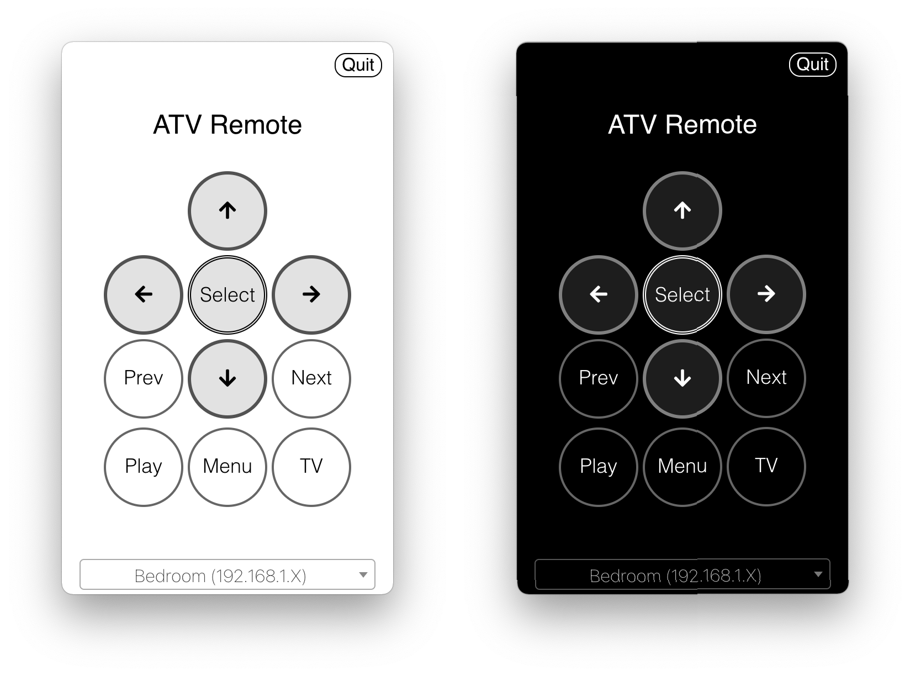

# ATV Desktop Remote
A simple menubar app that allows you to control an Apple TV from your desktop

 

 ## Update: Keyboard input works 
 
 The latest version works with tvOS 15 and up. It requires Python 3 to be installed on the system to work properly. 
 
 When the program starts, it will attempt to install the necessary modules for Python to work properly. If you have custom scripts under the working directory, please check the release notes for v1.1.1 to see what steps you need to take for this to work for you.
 On first run this program will run `pip` to install modules under a self-contained `env` directory. This program still works as it used to once it is running, but it does use a more complex method for communicating with the Apple TV. 

 Also note if you don't see an option for entering text, you may need to pair with your ATV again. You have to enter 2 codes instead of 1 because sending text to search fields uses a different protocol. 

 ## Download

 I've created macOS and Windows releases available here: https://github.com/bsharper/atv-desktop-remote/releases

## Usage

 1. All of the keys are mapped to the keyboard when the application is open (pressing return or enter on the keyboard for select, delete for Menu, etc).
 2. Press `Option`, or `Alt` on Windows, to see what the characters are mapped to when the application is open.

 ## Running

 1. Run `npm install` or `yarn`
 2. Run `npm start` or `yarn start`
 3. The application runs in the menubar. Look for a tiny remote icon and click on it. Right-click for more options.
 4. The first time the app runs it will need to pair with an Apple TV. You can pair with more than one.
 5. Press `Cmd+Shift+R` to open the application from anywhere. On Windows its `Win+Shift+R`

## Building

1. `electron-builder` is used to create a standalone application.

## Notes

This is cobbled together from a few projects I've worked on. It works well enough for me for daily use, so I figured others might like it. 

This project is built using [pyatv.](https://pyatv.dev/)

